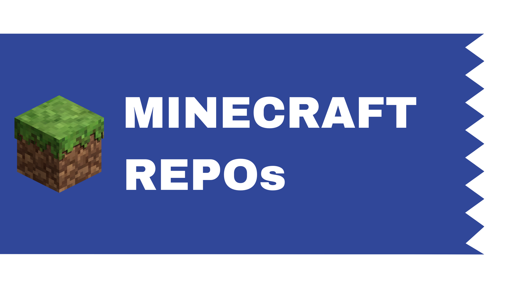

### Hi there, I'm <a href="https://empee.tk" target="_blank">Manuel</a> 

<div>
<a href="https://wakatime.com/@ab3994fa-02c7-4a2b-a058-300a7cc9c93b"></a>
<a href="https://telegram.me/Mr_EmPee"></a>
<a href="https://discord.com/users/259404274985992192"></a>
<a href="https://www.patreon.com/EmPee/"></a>
</div><br>

I would like to introduce myself as a full-stack software developer but unfortunately more water need to flow.

At the moment as a student and freelancer my objective is working on my passions and build up my education. Open a GitHub profile to collaborate with others and share my works seems to me a good start.

<a href="https://github.com/Mr-EmPee"></a>

**Talking about Personal Stuffs:**

- 👨🏻‍💻 I’m currently working on something called <em>JarCloud</em>

</br>

📊 **This Week I Spent My Time On:**
<!--START_SECTION:waka-->

```text
Java         13 hrs 45 mins  ███████████████████████░░   92.21 %
Kotlin       35 mins         █░░░░░░░░░░░░░░░░░░░░░░░░   03.97 %
YAML         14 mins         ▒░░░░░░░░░░░░░░░░░░░░░░░░   01.66 %
Text         8 mins          ▒░░░░░░░░░░░░░░░░░░░░░░░░   00.90 %
Properties   4 mins          ░░░░░░░░░░░░░░░░░░░░░░░░░   00.52 %
Markdown     3 mins          ░░░░░░░░░░░░░░░░░░░░░░░░░   00.43 %
```

<!--END_SECTION:waka-->
<div>
 <a href="https://github.com/MP-MC"></a>
 <a href="https://empee.tk"></a>
</div>
